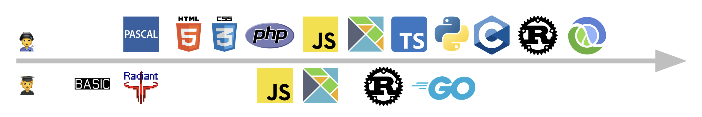
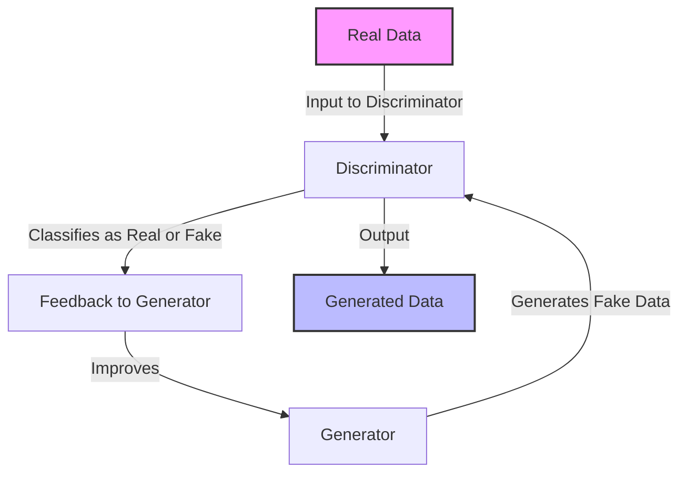
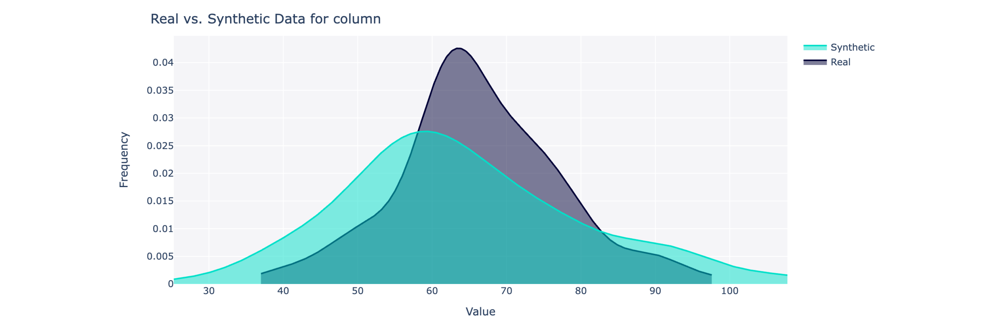
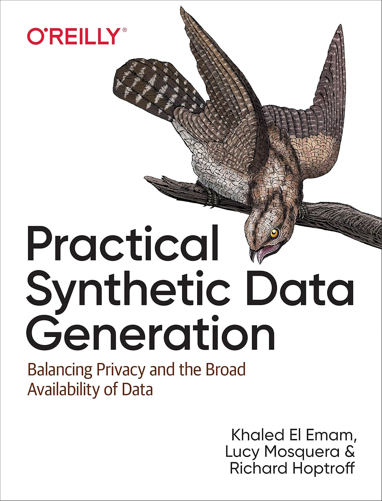
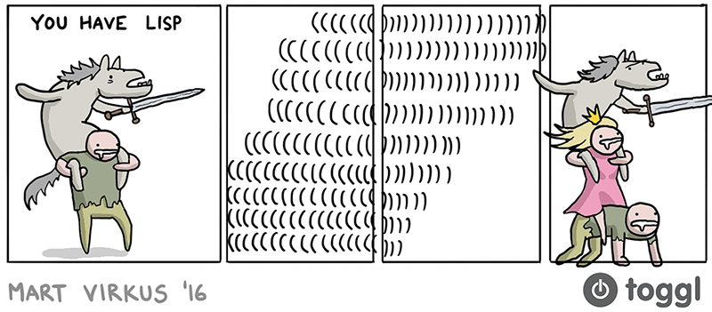
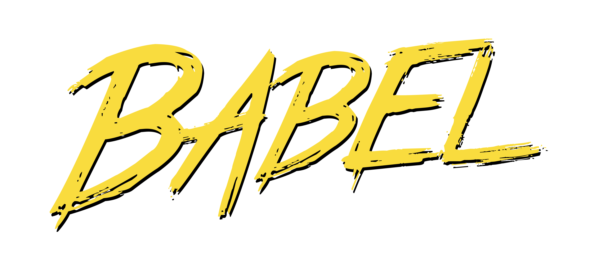
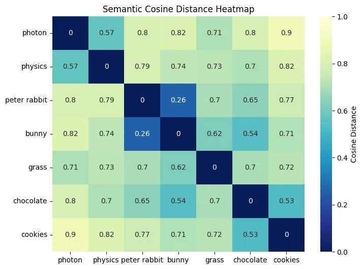

---
# You can also start simply with 'default'
theme: seriph
# random image from a curated Unsplash collection by Anthony
# like them? see https://unsplash.com/collections/94734566/slidev
background: ./static/IMG_2578.png
# some information about your slides (markdown enabled)
title: Staying relevant as a programmer in the world with LLMs
info: |
  ##  In this talk, I’ll share why coding still matters in the age of AI and show how we can blend those skills with tools like LLMs. As a hands-on example, I’ll demo an AI agent that customizes a CV for any job description—proving we can all stay relevant by staying curious, experimenting with new tech, and building solutions that make a real impact.
# apply unocss classes to the current slide
class: text-center
# https://sli.dev/features/drawing
drawings:
  persist: false
# slide transition: https://sli.dev/guide/animations.html#slide-transitions
transition: slide-left
# enable MDC Syntax: https://sli.dev/features/mdc
mdc: true
hideInToc: true
---

# Staying relevant as a programmer in the world with LLMs

Finding Balance, Adapting, and Keeping the Joy of Coding

<!-- <div @click="$slidev.nav.next" class="mt-12 py-1" hover:bg="white op-10">
  Press Space for next page <carbon:arrow-right />
</div> -->

<!--
The last comment block of each slide will be treated as slide notes. It will be visible and editable in Presenter Mode along with the slide. [Read more in the docs](https://sli.dev/guide/syntax.html#notes)
-->

---
transition: fade-out
layout: image-right
image: ./static/IMG_1851.png
hideInToc: true
---

# Roadmap

<Toc minDepth="1" maxDepth="1" />

---
layout: default
hideInToc: true
---

<div class="flex">
  <div class="flex-1 pr-4">
    <div>
      <h1>Eduard Kyvenko</h1>
      <h2>Lead Engineer @ Tuxedo Code</h2>
      
    </div>
  </div>

  <div class="w-1/4">
    
  </div>
</div>

<div>
    <div class="mt-4">
      <ul>
        <li>I Like Free and open-source software as a maintainer, contributor and user ❤️</li>
        <li><b>Professional Journey Since 2012</b>
          <ul>
            <li>Freelance Software Engineer (Tuxedo Code 🤵‍♂️)</li>
            <li>Love Functional Programming and learning new programming languages</li>
            <li>Over the years: less time in code, more time in stakeholder management</li>
          </ul>
        </li>
      </ul>
    </div>
        <div class="mt-4">
      <a href="https://www.linkedin.com/in/eduard-kyvenko-9a04503a/" target="_blank">
        <carbon:logo-linkedin /> https://www.linkedin.com/in/eduard-kyvenko-9a04503a/
      </a>
    </div>
    <div class="mt-2">
      <a href="https://github.com/halfzebra" target="_blank">
        <carbon:logo-github /> https://github.com/halfzebra
      </a>
    </div>
    </div>

---
layout: center
background: ./static/IMG_2599.png
---

Would be sad if something took the joy of programming from us, wouldn’t it? 💔


---
layout: image-right
image: ./static/IMG_2601.png
level: 2
---

# The Reality always has it's own plans

- **November 30, 2022**: ChatGPT launched  
- **February 24, 2022**: Invasion of Ukraine 

- **Why It Matters**
  - Career and Big Tech takes second place
  - Safety of family and mental health are top priorities
  - No time and enrgy for learning new tech
  - Decided to switch to consulting

---
layout: two-cols
---

# First professional exposure to AI/ML

- **Synthetic Data Generation (2022-10-01)**
  - Not traditionally focused on ML, but got involved in a short project
  - Built an ETL pipeline for a GAN-based data generation approach

- **What is GAN (Generative Adversarial Network)?**  
  - Two models (generator & discriminator) “compete” to produce realistic synthetic data  
  - Retains key statistical properties without leaking real user info

::right::




---
level: 2
layout: two-cols-header
---

# Practical Synthetic Data Generation

::left::
- **Tool Used:** [SDV (Synthetic Data Vault)](https://github.com/sdv-dev/SDV)  
- **What I Did:**
  - Extracted internal SQL Server columt metadata from a 140Gb~ database with relations
  - Created Python to export metadata in a SDV format
  - Enabled human
- **Book Reference:** _Practical Synthetic Data Generation: Balancing Privacy and the Broad Availability of Data_  
  - Great insights into privacy-preserving data generation
  - Explains how evaluate the produced data

::right::


---
layout: image-right
image: ./static/IMG_2581.png
---

# Hiding from AI

- **New Project:** No AI usage allowed for code generation. 
-   Project Success, Moving On
- **Meanwhile...** the buzz about LLMs and ChatGPT began to dominate tech news  
- **Still Found a use-case:**  
  - Using ChatGPT for **study** is perfeclty legal, as long as no AI-generated code is committed  
  - Needed to learn Clojure from scratch

---
level: 2
---

# Clojure & AI Experience

- **LLMs for Reading Complex Code** 
  - Learning a new programming language and one of the largest code-bases I've ever seen
  - Breaking down third-party library macroses  
  - Explaining advanced Clojure concepts
  - Claude is actually better than ChatGPT for this task



---
level: 2
layout: two-cols-header
---

# Automated Code Analysis and Copilot

::left::

- **Next Assignment (Nov 2024):**  
  - Perform code analysis on a medium-sized project  
  - Extract data report for compliance  
- **Approach:**  
  - Leveraged AST (Abstract Syntax Trees) and Babel.js 💪
  
  - Built an analyzer tool:
    __AST-based code analysis + code generation__
  - Eventually simplified to Regex 😅

::right::

```js
import { parse } from '@babel/parser';
import traverse from '@babel/traverse';
import generate from '@babel/generator';

const code = 'const n = 1';

// parse the code -> ast
const ast = parse(code);

// transform the ast
traverse(ast, {
  enter(path) {
    // in this example change all the variable `n` to `x`
    if (path.isIdentifier({ name: 'n' })) {
      path.node.name = 'x';
    }
  },
});

// generate code <- ast
const output = generate(ast, code);
console.log(output.code); // 'const x = 1;'
```

---
layout: image-left
image: ./static/IMG_2588.png
level: 2
---

# Success, But Self-Doubt

- **Project Completed Successfully**  
- **However...**  
  - “Was it me who delivered, or the AI-powered tools?”  
  - Fear and insecurity started to creep in 😬
- **Bigger Realization:**  
  - AI was moving fast
  - This felt bigger than JavaScript or any single technology wave 🌊

---
layout: default
---

# A grain of scepticism

<div class="grid grid-cols-3 gap-8">
  <div class="flex flex-col items-center gap-4">
    
    <h3>Carl Brown</h3>
    <div class="text-center mb-4">
      <a href="https://www.youtube.com/@InternetOfBugs" target="_blank">Internet of Bugs</a>
    </div>
    <div class="text-sm">
      <h4 class="font-bold mb-2">Key Insights:</h4>
      <ul class="list-disc pl-4">
        <li>Debunking AI startup speculation</li>
        <li>Strategical career advise</li>
        <li>Competent perspective of an experienced engineer</li>
      </ul>
    </div>
  </div>
  <div class="flex flex-col items-center gap-4">
    
    <h3>Dragos & Bogdan</h3>
    <div class="text-center mb-4">
      <a href="https://www.youtube.com/@therealseniordev" target="_blank">The Senior Dev</a>
    </div>
    <div class="text-sm">
      <h4 class="font-bold mb-2">Notable Content:</h4>
      <ul class="list-disc pl-4">
        <li>Deep dive into white papers</li>
        <li>AI's impact on software careers</li>
        <li>Practical advise for JavaScript focused career</li>
      </ul>
    </div>
  </div>
  <div class="flex flex-col items-center gap-4">
    
    <h3>Yanis Varoufakis</h3>
    <div class="text-center mb-4">
      <a href="https://www.yanisvaroufakis.eu/" target="_blank">Economist & Author</a>
    </div>
    <div class="text-sm">
      <h4 class="font-bold mb-2">Political Perspective:</h4>
      <ul class="list-disc pl-4">
        <li>AI & Technofeudalism</li>
        <li>Economic power dynamics</li>
        <li>Market manipulation concerns</li>
      </ul>
    </div>
  </div>
</div>

---
layout: image-right
image: ./static/IMG_2571.png
level: 2
---

#  Overcoming Fear

- **Analyzing Research & Benchmarks**  
  - AI coding tools are powerful but still limited
  - Human oversight, domain expertise, and creativity remain invaluable  
- **Peace of Mind**  
  - Knowledge is power: the more you understand AI’s strengths/weaknesses, the less intimidating it becomes  
  - Tools like ChatGPT & Copilot are **enhancements**, not complete replacements

---

# Embracing AI Tooling

- **Decision:** I decided to lean into AI—subscribing to ChatGPT, Gemini, and Copilot.
- **Experimenting:**
  - [localai.io](https://localai.io/) Too slow for local usage, not as good as Claude.ai at other programming languages
  - [ollama.com](https://ollama.com/) Great tool for experimenting with models
- **Fast Forward to 2025:**
  - Left my previous client project
  - Needed to update my CV for multiple job applications 😅
- **The IT Job Market Reality:**  
  - More competitive, economical changes
  - Requires targeted resumes for each role

---
layout: two-cols
layoutClass: gap-16
---
# Structured Resumes

- **Introducing**: `resume-cli` and `json-resume`  
  - Using them for years to maintain my CV in a JSON format  
  - As a programmer, structured data is easier to manipulate  
- **HackMyResume & FRESH**  
  - [HackMyResume](https://github.com/hacksalot/HackMyResume)  
  - FRESH resume format: Another structured approach
- **Benefits of JSON**  
  - Good fit for automation
  - Simplifies versioning and customization

::right::

```json
{
  "basics": {
    "name": "Jane Doe",
    "label": "Frontend Developer",
    "email": "jane.doe@example.com",
    "phone": "(123) 456-7890",
    "summary": "Frontend developer with 4 years of experience in building responsive web applications using React.",
  },
  "work": [
    {
      "company": "Tech Company",
      "position": "Frontend Developer",
      "startDate": "2020-01-01",
      "summary": "Developed and maintained various frontend applications",
      "highlights": [
        "Built responsive UI components using React.js",
        "Implemented state management using Redux",
      ]
    }
  ]
}
```

---
layout: two-cols-header
---

# GPT + Manual to Automated CV Customization
::left::
- **Why AI for CV Writing?**  
  - Tired of rewriting the same sections for each job listing  
  - ChatGPT can help tailor language, highlight relevant skills, etc.  
- **Reality Check:**  
  - Still lots of manual work (data entry, verification)  
  - Dream: Full automation for generating role-specific resumes

::right::

- **Spark of an Idea:**  
  - Automate resume adjustments to match a specific job description  
  - Let AI parse job requirements + CV JSON → suggest edits  
- **The Research:**  
  - The AI tooling ecosystem felt overwhelming (reminiscent of 2017 JS fatigue)  
  - Explored everything from no-code (n8n, Zapier) to specialized frameworks


---
level: 2
---

# Exploring 🦜️🔗 LangChain.js
- **Why LangChain?**
  - <https://github.com/langchain-ai/langchainjs>
  - Model-agnostic framework for building LLM applications
  - Suitable for building agends, with human-in-the-loop capabilities
  - Python vs. JavaScript versions → language shouldn’t matter if it’s just waiting for LLM responses  
- **LangChain.js**  
  - Familiar environment for a JavaScript expert  
  - Docs can be chaotic, but readable  
- **Reference**:  
  - <https://github.com/mahseema/awesome-ai-tools>

---
level: 2
---

# Live Demo & Code Examples

- **Small Use Case**  
  - Parsing JSON CV + job description → generating tailored recommendations 

- **Implementation Highlights**  
  1. **LangChain.js** pipeline set up
  2. **Prompt templates**: structured prompts for consistent results
  3. **Output**: structured data with edit suggestions 

- **Why This Matters**  
  - Demonstrates how AI can automate mundane tasks  
  - Sparks ideas for bigger workflow automations

---
level: 2
---

# Structured Output with LangChain.js

````md magic-move {lines: true}
```ts {*|2|*}
import { ChatOpenAI } from '@langchain/openai';

const model = new ChatOpenAI({
  model: 'gpt-4o-mini',
  temperature: 0,
});
```

```ts {*|2|*}
import { ChatOpenAI } from '@langchain/openai';
import { z } from 'zod';

const jobRequirementsZod = z.object({
  skills: z.array(z.string()).describe('Required skills for the job'),
  experience: z.array(z.string().describe('Required experience for the job')),
  special: z
    .array(z.string().describe('Special requirements for the job'))
    .optional(),
});

const model = new ChatOpenAI({
  model: 'gpt-4o-mini',
  temperature: 0,
});

const structuredLlmJobRequirements =
  model.withStructuredOutput(jobRequirementsZod);
```

```ts {*|2|*}
import { ChatOpenAI } from '@langchain/openai';
import { HumanMessage, SystemMessage } from '@langchain/core/messages';
import { z } from 'zod';

const jobRequirementsZod = z.object({
  skills: z.array(z.string()).describe('Required skills for the job'),
  experience: z.array(z.string().describe('Required experience for the job')),
  special: z
    .array(z.string().describe('Special requirements for the job'))
    .optional(),
});

const model = new ChatOpenAI({ model: 'gpt-4o-mini', temperature: 0 });

const prompt = `Take a job description and create lists of required skills,
    experience and special requirements(if anything is present) for the job`

const structuredLlmJobRequirements = model.withStructuredOutput(jobRequirementsZod);

await structuredLlmJobRequirements.invoke([new SystemMessage(prompt), new HumanMessage(jobDescription)]);
```
````

---
level: 2
---

# How to avoid cluter?

````md magic-move {lines: true}
```ts {*|2|*}
import { ChatOpenAI } from "@langchain/openai";
import { PromptTemplate } from "@langchain/core/prompts";
import { JsonOutputParser } from "@langchain/core/output_parsers";
import { RunnableSequence } from "@langchain/core/runnables";

const model = new ChatOpenAI({ temperature: 0 });
```

```ts {*|2|*}
import { ChatOpenAI } from "@langchain/openai";
import { PromptTemplate } from "@langchain/core/prompts";
import { JsonOutputParser } from "@langchain/core/output_parsers";
import { RunnableSequence } from "@langchain/core/runnables";

const model = new ChatOpenAI({ temperature: 0 });
const cvAnalysisPrompt = PromptTemplate.fromTemplate(`
  Compare this CV with the job requirements and identify matches and gaps:
  CV: {cv}
  Job Requirements: {requirements}
`);
const outputParser = new JsonOutputParser();
```

```ts {*|2|*}
import { ChatOpenAI } from "@langchain/openai";
import { PromptTemplate } from "@langchain/core/prompts";
import { JsonOutputParser } from "@langchain/core/output_parsers";
import { RunnableSequence } from "@langchain/core/runnables";

const model = new ChatOpenAI({ temperature: 0 });
const cvAnalysisPrompt = PromptTemplate.fromTemplate(`
  Compare this CV with the job requirements and identify matches and gaps:
  CV: {cv}
  Job Requirements: {requirements}
`);
const outputParser = new JsonOutputParser();

const cvAnalysisChain =
 RunnableSequence.from([cvAnalysisPrompt, model, outputParser]);

const result = await cvAnalysisChain.invoke({
  cv: "4 years React experience, Redux, Jest, HTML/CSS",
  requirements: "5+ years React, TypeScript, Redux, CSS"
});
// Result: {matches: [...], gaps: [...], recommendations: [...]}
```
````

---
layout: two-cols
---

# Diving into AI Agents & RAG

- [Build a RAG based Generative AI Chatbot in 20 mins using Amazon Bedrock Knowledge Base](https://www.youtube.com/watch?v=hnyDDfo8e9Q)
- [Learn LangChain.js - Build LLM apps with JavaScript and OpenAI](https://www.youtube.com/watch?v=HSZ_uaif57o)  
  - **RAG (Retrieval-Augmented Generation)** explained:  
    - Combines external data sources with LLM queries for more accurate responses  
    - Useful when you have a large, relevant dataset to reference
- **My CV Analyzer**  
  - Turns out that I don't need RAG because it’s just my single CV 😮‍💨
  - Very easy to setup, you can even use PostgreSQL with a specialised plug-in 🚀

::right::



<div class="flex justify-center">
  <div class="w-3/4 text-sm text-gray-500 mt-2 italic text-center">
    <a href="https://ai.gopubby.com/what-is-semantic-similarity-an-explanation-in-the-context-of-retrieval-augmented-generation-rag-78d9f293a93b" target="_blank" class="no-underline">
      Source: What is Semantic Similarity in RAG Context - Ingrid Stevens
    </a>
  </div>
</div>

---
layout: image-left
image: ./static/IMG_2236.png
level: 2
---

# Reflection, Slower Pace & Tiny Wins

- Early on, I’d chase every new tech wave—move fast, break things, burn out.™  
- But then: wars, personal setbacks, job constraints...  
- Learning slowed down. That's a bit scary 👻.  
- Hype cycles don’t help—every day a new “must-learn” AI tool.

**What helped:**  
- Dropping the guilt.  
- Picking tools that solve *my* problems.  
- Building small things—even when the big picture felt overwhelming.

---
layout: image-left
image: ./static/IMG_0125.png
level: 2
---

# AI Didn’t Kill the Joy—It Brought It Back

- I started this journey unsure if AI would replace me.  
- I ended up using it to write, learn, experiment—and benefit fromt he results.
- That small CV customizer? It reminded me I still like building things.

**So if you’re feeling behind:**  
- Don’t try to “catch up.”  
- Just build something tiny with whatever excites (or scares) you.  
- That’s how we stay relevant. That’s how we stay in the game.

**Thanks for listening. Keep hacking. Stay curious.** 👋


---

# Final Q&A

- **Open Discussion**
  - Questions about LangChain, structured resumes, or CV automation?  
  - Thoughts on balancing AI adoption with personal well-being?

- **Closing Note**
  - “Stay curious, keep creating, and lean on tools that make your life easier. AI isn’t the enemy—it’s your next big ally.”

---
layout: image-left
image: ./static/IMG_0125.png
level: 2
---

# Thank you!